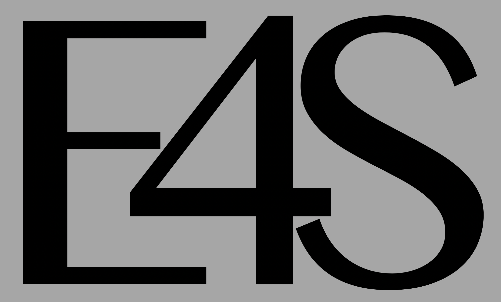
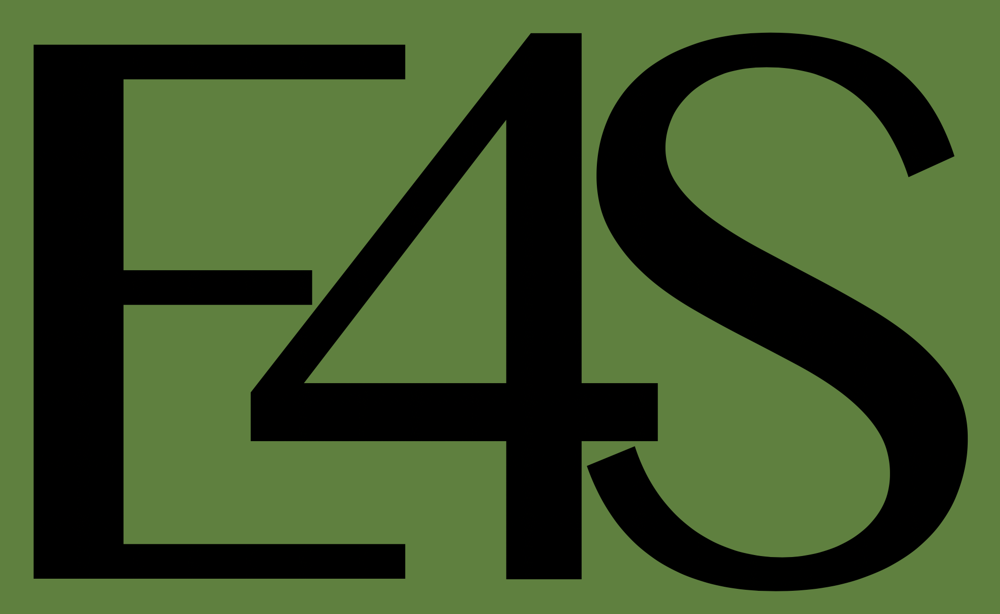

# logos

This repo contains a set of logos for the Extreme-scale Scientific Software Stack (E4S) project.  

Presently, we have 3 E4S logos:

- E4S-light-grey.png (preferred unless one of the others is needed for color differentials)
- E4S-dark-green.png	
- E4S-dark-grey.png	

# Thumbnails
<Table>
  <TR>
    <TH>Logo</TH>
    <TH>Thumbnail</TH>
  </TR>
  <TR>
    <TD>E4S-light-grey.png (preferred)</TD>
    <TD></TD>
  </TR>
  <TR>
    <TD>E4S-dark-green.png</TD>
    <TD></TD>
  </TR>
  <TR>
    <TD>E4S-dark-grey.png</TD>
    <TD></TD>
  </TR>
</Table>
